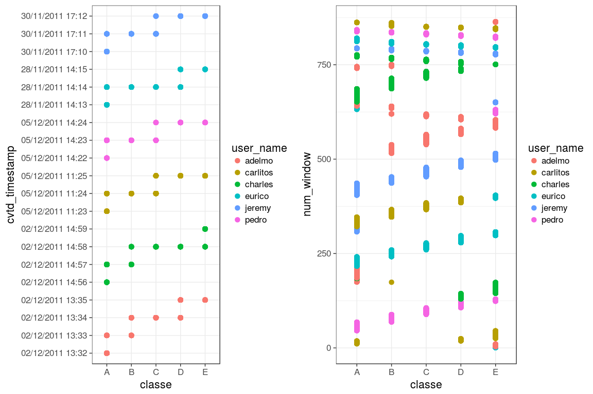
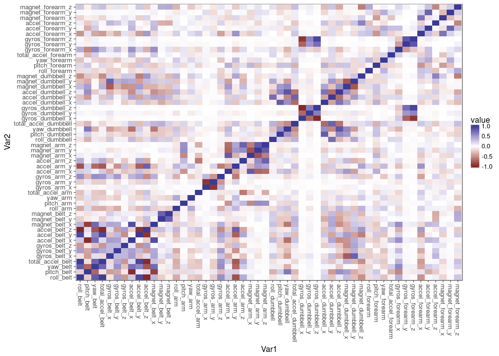
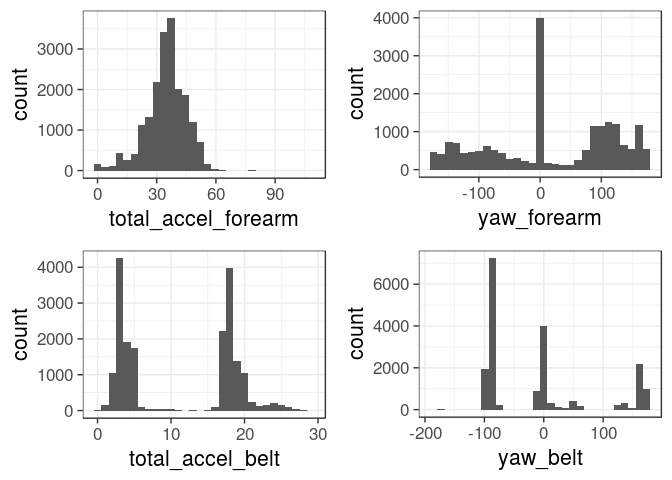
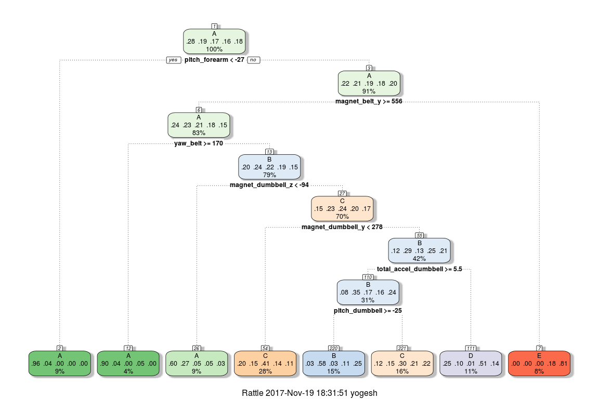

# Excerise in a Goodway


```r
knitr::opts_chunk$set(fig.width=12, fig.height=8, warning=FALSE, message=FALSE)
library(caret); library(ggplot2); library(reshape2);library(gridExtra); library(dplyr)
```


#Background

There are a host of new wearable electronic devices which can track the quantity of activity in which a person engages. An unresolved problem, however, is how to determine whether such activity is being done properly. In other words, we would like to know about the quality of activity/exercise, not just the quantity.

The goal of this project is to use data from accelerometer measurements of participants engaged in different classes of physical activity - bicep curls in this case - to predict whether the exercise is being done properly or improperly based solely on accelerometer measurements. The participants were each instructed to perform the exercise either properly (Class A) or in a way which replicated 4 common weightlifting mistakes (Classes B, C, D, and E). 

More information is available online [here](http://groupware.les.inf.puc-rio.br/har#weight_lifting_exercises) and the results of this study have been published [here](http://groupware.les.inf.puc-rio.br/work.jsf?p1=11201). 


```r
set.seed(3399)
#urlTraining <- "https://d396qusza40orc.cloudfront.net/predmachlearn/pml-training.csv"
#urlValidation <- "https://d396qusza40orc.cloudfront.net/predmachlearn/pml-testing.csv"
fullData <- read.csv('pml-training.csv', header = T, na.strings = c("", "NA"))
validation <- read.csv('pml-testing.csv', header = T, na.strings = c("", "NA"))
nzv <- nearZeroVar(fullData,saveMetrics=TRUE)
```


#Exploring the data


**Note: I originally split this set into training and testing prior to exploring the data and removing inappropriate variables, but for the purposes of this report I show that analysis first, then split the data after all of the offending columns are removed**

One of the first things to note is that there are many dummy variables in these data. Several columns do not have measurements for each observation, but are rather summary statistics for one sliding window. The paper suggests that a "sliding window" of time is anywhere between 0.5 and 2.5 seconds of activity.

In the validation data which we would like to predict are just random draws of one observation at a particular time point. That being the case, we can easily omit many of the summary variables in this dataset as they are not useful for this particular prediction problem, and also seem to be mislabeled in some cases (e.g. the summary statistics are in the wrong columns). The inappropriate structure of these variables is borne out by the near zero variances of these variables (not shown).

I can remove all rows which contain summary statistics and not observational data. I can also filter out all columns which serve only to present summary data. I can also remove the "X" variable, which is just the row number and the "new_window" variable which was only a marker for summary variable rows.


While there are a lot of continuous and integer variables in these data, there is an interesting pattern that we can glean from the factor variables: most notably from the `user_name`, `classe`, and `cvtd_timestamp` variables.

In the following exploratory plots, for example, we can see that the participants in this study all performed these trials in temporal order. They all started doing biceps curls the proper way (Class A), then proceeded with Class B, then C, etc. They are also all easily idenifiable by the `num_window` variable:


```r
theme_set(theme_bw(base_size = 16))
a <- qplot(classe, cvtd_timestamp, data=fullData, color=user_name, size=I(3))
b <- qplot(classe, num_window, data=fullData, color=user_name, size=I(3))

grid.arrange(a, b, ncol=2)
```

<!-- -->


This relationship is an artifact of the study design which would allow us to predict the validation data with great accuracy, but will fail if we are trying to accurately predict new data given only accelerometer measurements. Therefore I'll further exclude all of the timestamp and username data if we want to accurately predict the exercise class based solely on accelerometer measurements.


```r
fullData <- filter(fullData, new_window == "no")
fullData <- Filter(function(x)!all(is.na(x)), fullData)
fullData <- select(fullData, -X, -new_window, -user_name, -cvtd_timestamp, 
                   -raw_timestamp_part_1, -raw_timestamp_part_2, -num_window)

# Also remove all the same columns from the test data set:
validation <- Filter(function(x)!all(is.na(x)), validation)
validation <- select(validation, -X, -new_window, -user_name, -cvtd_timestamp, 
                   -raw_timestamp_part_1, -raw_timestamp_part_2, -num_window)

#Have we done a good job?
nzv <- nearZeroVar(fullData, saveMetrics=TRUE)
```


### Dealing with multicollinearity

Now I want to examine these data for multicollinearity. I want to trim variables that are highly correlated


```r
cor.matrix <- cor(fullData[sapply(fullData, is.numeric)])
c <- melt(cor.matrix)
qplot(x=Var1, y=Var2, data=c, fill=value, geom="tile") +
   scale_fill_gradient2(limits=c(-1, 1)) +
    theme(axis.text.x = element_text(angle=-90, vjust=0.5, hjust=0))
```

<!-- -->


It does seem that some of the variables are highly correlated. I'll pare down the dataset by removing variable that are highly correlated (over 0.9):


```r
c <- findCorrelation(cor.matrix, cutoff = .90)
fullData <- fullData[,-c]
validation <- validation[,-c]
```


Looking through the data using `hist` from the `Hmisc` package on the full data set, some of the variables seem normally distributed while others are clearly multimodal. Here are just a few examples:

<!-- -->


# Cross Validation

While the data is split online into a "training" and "testing" set already, the "testing" set is really for the purposes of validation for the assignment. I will split the full data (what is labeled as the "training" data online) into training and testing sets in order to continue these analyses. I am splitting into 70% training and 30% testing.


```r
inTrain <- createDataPartition(y=fullData$classe, p=0.7, list=FALSE)
training <- fullData[inTrain, ]; testing <- fullData[-inTrain, ]
```


# Model Exploration and Building


To begin with, I will try to build a model using classification trees. It's somewhat unclear to me based on what I've learned so far in the class which model building method is most appropriate in certain situations. I need to learn a lot more about that on my own, however it seems like it might be best to build models without the assumptions of normality since that assumption is violated in some of these variables. 

Here is a classification tree:


```r
library(rattle)
modfit_tree <- train(classe ~ ., method="rpart", data=training)
fancyRpartPlot(modfit_tree$finalModel)
```

<!-- -->


This worked, but it also doesn't really look like the classification tree does a great job and I think I could do a lot better. I don't want to check this on the test set yet because I think I can do better by using a random forests model building method on the training set. 

## Random Forests model

Thanks to this [kaggle forum post](https://www.kaggle.com/forums/f/15/kaggle-forum/t/7951/r-party-package-cforest-memory-problem/44392) with help for running the random forest method on a computer with low RAM since R kept crashing in my original implementation. 


```r
library(randomForest)
mtry <- tuneRF(training[,-46], training$classe, ntreeTry=500, stepFactor=1.5,improve=0.01, 
               plot=FALSE, trace=TRUE, dobest=FALSE)
modfit_rf <- randomForest(classe~.,data=training, mtry=9, ntree=500)
```


When I look at the model it looks good so far in terms of the accuracy of classification, so I'll test this model on the testing dataset:


```r
pred <- predict(modfit_rf, testing)
confusionMatrix(pred, testing$classe)
```

```
## Confusion Matrix and Statistics
## 
##           Reference
## Prediction    A    B    C    D    E
##          A 1640    6    0    0    0
##          B    1 1104    1    0    0
##          C    0    5 1002   10    1
##          D    0    0    2  934    0
##          E    0    0    0    0 1057
## 
## Overall Statistics
##                                           
##                Accuracy : 0.9955          
##                  95% CI : (0.9934, 0.9971)
##     No Information Rate : 0.2847          
##     P-Value [Acc > NIR] : < 2.2e-16       
##                                           
##                   Kappa : 0.9943          
##  Mcnemar's Test P-Value : NA              
## 
## Statistics by Class:
## 
##                      Class: A Class: B Class: C Class: D Class: E
## Sensitivity            0.9994   0.9901   0.9970   0.9894   0.9991
## Specificity            0.9985   0.9996   0.9966   0.9996   1.0000
## Pos Pred Value         0.9964   0.9982   0.9843   0.9979   1.0000
## Neg Pred Value         0.9998   0.9976   0.9994   0.9979   0.9998
## Prevalence             0.2847   0.1935   0.1744   0.1638   0.1836
## Detection Rate         0.2846   0.1916   0.1739   0.1621   0.1834
## Detection Prevalence   0.2856   0.1919   0.1766   0.1624   0.1834
## Balanced Accuracy      0.9990   0.9949   0.9968   0.9945   0.9995
```


This worked very well. The Random Forests model yielded highly accurate predictions on the testing data set. The accuracy of this model on the testing dataset was `0.9957`, which is a good estimate of the out-of-sample accuracy. It's possible that this could be improved upon by parameterizing the random forests method in a different fashion, but for the current purposes I'm very happy with this model. 


# Predictions


All that is left is to use this model to predict the classes of the validation data:


```r
pred_val <- predict(modfit_rf, validation)
pred_val
```

```
##  1  2  3  4  5  6  7  8  9 10 11 12 13 14 15 16 17 18 19 20 
##  B  A  B  A  A  E  D  B  A  A  B  C  B  A  E  E  A  B  B  B 
## Levels: A B C D E
```
